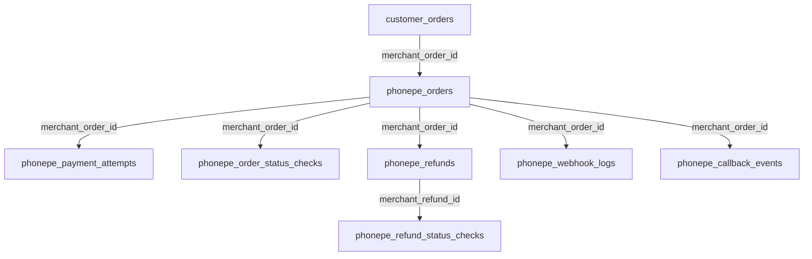
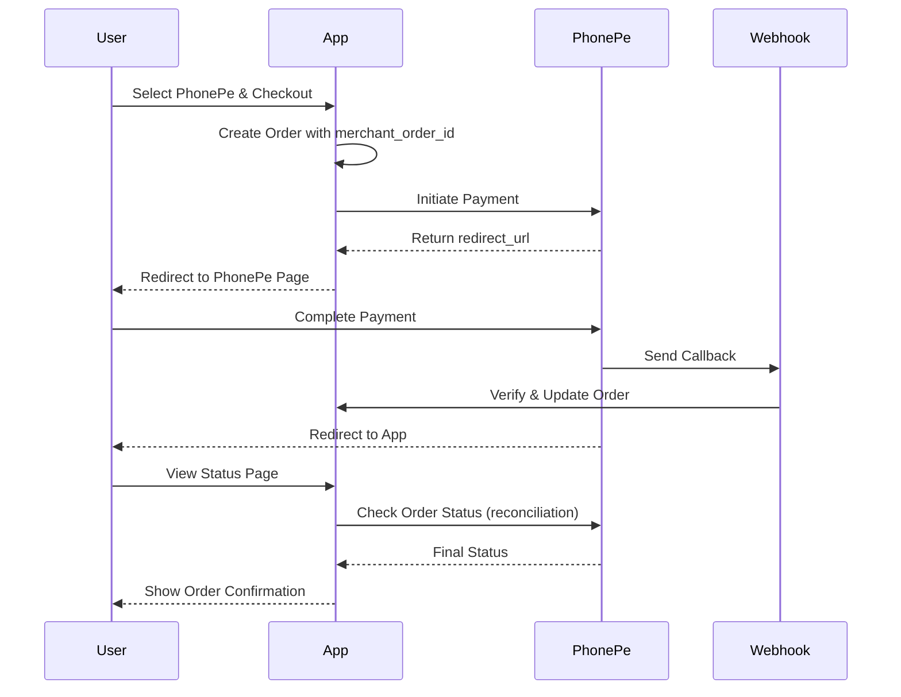

---
**USER REQUEST:**  
"Based on the docs/phonepe/ppg.md and ppg-db-guide Prepare the PhonePe Integration into the App"

**DOCUMENT CREATED:**  
2025-12-30T20:04:02+05:30
---

# PhonePe Payment Gateway Integration - Implementation Plan

## Executive Summary

This implementation plan outlines the complete integration of **PhonePe Payment Gateway** into the Harees Jewellery Laravel application. The integration will support payment initiation, order status checking, refunds, webhook handling, and comprehensive audit logging following PhonePe SDK best practices.

---

## User Review Required

> [!IMPORTANT]
> **PhonePe Credentials Required**  
> Before implementation begins, you must obtain UAT credentials from PhonePe:
> - Client ID
> - Client Secret  
> - Client Version
> - Merchant ID
> 
> These will be stored securely in the `.env` file and MUST NOT be committed to version control.

> [!WARNING]
> **Breaking Changes to Checkout Flow**  
> The current checkout flow uses COD (Cash on Delivery) only. This integration will:
> - Add PhonePe as a payment method
> - Modify the checkout process to include payment gateway integration
> - Change order status workflow to handle pending/completed/failed states
> - Require users to complete payment before order confirmation

> [!CAUTION]
> **Database Schema Changes**  
> This implementation requires adding 8 new database tables for PhonePe integration. Ensure database backups are taken before running migrations.

---

## Proposed Changes

### Component 1: Composer Dependencies & SDK Installation

#### [MODIFY] [composer.json](file:///c:/wamp64/www/github/Harees-New/composer.json)

Add PhonePe PHP SDK repository configuration and required dependencies:

```json
{
  "repositories": [
    {
      "type": "package",
      "url": "./vendor/phonepe/pg-sdk-php/",
      "package": {
        "name": "phonepe/pg-php-sdk-v2",
        "version": "2.0.0",
        "dist": {
          "url": "https://phonepe.mycloudrepo.io/public/repositories/phonepe-pg-php-sdk/v2-sdk.zip",
          "type": "zip"
        },
        "autoload": {
          "classmap": ["/"]
        }
      }
    }
  ],
  "require": {
    "phonepe/pg-php-sdk-v2": "^2.0",
    "netresearch/jsonmapper": "^4.4"
  }
}
```

**Note:** The SDK already requires `vlucas/phpdotenv` which is included in Laravel by default.

---

### Component 2: Environment Configuration

#### [MODIFY] [.env.example](file:///c:/wamp64/www/github/Harees-New/.env.example)

Add PhonePe configuration variables:

```env
# PhonePe Payment Gateway Configuration
PHONEPE_ENVIRONMENT=PRODUCTION
PHONEPE_CLIENT_ID=
PHONEPE_CLIENT_SECRET=
PHONEPE_CLIENT_VERSION=
PHONEPE_MERCHANT_ID=
PHONEPE_WEBHOOK_USERNAME=
PHONEPE_WEBHOOK_PASSWORD=
PHONEPE_ENABLE_LOGGING=false
PHONEPE_CALLBACK_URL="${APP_URL}/phonepe/callback"
PHONEPE_REDIRECT_URL="${APP_URL}/payment/status"
```

---

### Component 3: Database Schema - PhonePe Tables

#### [NEW] Migration Files (8 Tables)

##### [NEW] `2025_12_30_create_phonepe_orders_table.php`

Master order tracking table:

```php
Schema::create('phonepe_orders', function (Blueprint $table) {
    $table->id();
    $table->string('merchant_order_id', 64)->unique();
    $table->string('phonepe_order_id', 64)->nullable();
    $table->bigInteger('amount'); // paisa
    $table->string('currency', 10)->default('INR');
    $table->enum('state', ['PENDING', 'COMPLETED', 'FAILED']);
    $table->enum('last_known_state', ['PENDING', 'COMPLETED', 'FAILED']);
    $table->bigInteger('expire_at')->nullable(); // epoch millis
    $table->text('redirect_url')->nullable();
    $table->timestamps();
    
    $table->index('state');
    $table->index('phonepe_order_id');
});
```

##### [NEW] `2025_12_30_create_phonepe_payment_attempts_table.php`

Payment attempt tracking:

```php
Schema::create('phonepe_payment_attempts', function (Blueprint $table) {
    $table->id();
    $table->string('merchant_order_id', 64);
    $table->string('transaction_id', 64)->nullable();
    $table->string('payment_mode', 32)->nullable();
    $table->enum('state', ['PENDING', 'COMPLETED', 'FAILED'])->nullable();
    $table->bigInteger('amount')->nullable();
    $table->bigInteger('timestamp')->nullable(); // epoch millis
    $table->string('error_code', 64)->nullable();
    $table->string('detailed_error_code', 128)->nullable();
    $table->json('raw_response')->nullable();
    $table->timestamps();
    
    $table->index('transaction_id');
    $table->index('merchant_order_id');
});
```

##### [NEW] `2025_12_30_create_phonepe_webhook_logs_table.php`

Raw webhook payload storage:

```php
Schema::create('phonepe_webhook_logs', function (Blueprint $table) {
    $table->id();
    $table->string('event_type', 64)->nullable();
    $table->string('merchant_order_id', 64)->nullable();
    $table->string('phonepe_order_id', 64)->nullable();
    $table->string('merchant_refund_id', 64)->nullable();
    $table->string('authorization_header')->nullable();
    $table->boolean('verified')->default(false);
    $table->json('payload');
    $table->timestamp('received_at')->useCurrent();
    $table->enum('processing_status', ['RECEIVED', 'PROCESSED', 'FAILED'])->default('RECEIVED');
    $table->text('failure_reason')->nullable();
});
```

##### [NEW] `2025_12_30_create_phonepe_order_status_checks_table.php`

Reconciliation polling history:

```php
Schema::create('phonepe_order_status_checks', function (Blueprint $table) {
    $table->id();
    $table->string('merchant_order_id', 64);
    $table->string('phonepe_order_id', 64)->nullable();
    $table->enum('state', ['PENDING', 'COMPLETED', 'FAILED'])->nullable();
    $table->bigInteger('amount')->nullable();
    $table->json('response')->nullable();
    $table->timestamp('checked_at')->useCurrent();
});
```

##### [NEW] `2025_12_30_create_phonepe_refunds_table.php`

Refund master table:

```php
Schema::create('phonepe_refunds', function (Blueprint $table) {
    $table->id();
    $table->string('merchant_refund_id', 64)->unique();
    $table->string('merchant_order_id', 64);
    $table->string('phonepe_refund_id', 64)->nullable();
    $table->bigInteger('amount');
    $table->enum('state', ['PENDING', 'CONFIRMED', 'COMPLETED', 'FAILED']);
    $table->timestamps();
    
    $table->index('merchant_order_id');
});
```

##### [NEW] `2025_12_30_create_phonepe_refund_status_checks_table.php`

Refund reconciliation:

```php
Schema::create('phonepe_refund_status_checks', function (Blueprint $table) {
    $table->id();
    $table->string('merchant_refund_id', 64);
    $table->enum('state', ['PENDING', 'CONFIRMED', 'COMPLETED', 'FAILED'])->nullable();
    $table->json('response')->nullable();
    $table->timestamp('checked_at')->useCurrent();
});
```

##### [NEW] `2025_12_30_create_phonepe_callback_events_table.php`

Normalized callback events:

```php
Schema::create('phonepe_callback_events', function (Blueprint $table) {
    $table->id();
    $table->enum('event', [
        'CHECKOUT_ORDER_COMPLETED',
        'CHECKOUT_ORDER_FAILED',
        'PG_REFUND_COMPLETED',
        'PG_REFUND_FAILED',
        'PG_REFUND_ACCEPTED'
    ]);
    $table->string('merchant_order_id', 64)->nullable();
    $table->string('merchant_refund_id', 64)->nullable();
    $table->string('state', 32)->nullable();
    $table->bigInteger('amount')->nullable();
    $table->bigInteger('occurred_at')->nullable(); // epoch millis
    $table->timestamps();
});
```

##### [NEW] `2025_12_30_create_phonepe_security_audit_table.php`

Security verification tracking:

```php
Schema::create('phonepe_security_audit', function (Blueprint $table) {
    $table->id();
    $table->enum('source', ['WEBHOOK', 'API']);
    $table->string('reference_id', 64)->nullable();
    $table->string('authorization_received')->nullable();
    $table->string('authorization_expected')->nullable();
    $table->boolean('verified');
    $table->text('remarks')->nullable();
    $table->timestamps();
});
```

#### [MODIFY] Existing Orders Table

##### [MODIFY] Migration for customer_orders table

Add PhonePe-related columns to existing orders:

```php
Schema::table('customer_orders', function (Blueprint $table) {
    $table->string('merchant_order_id', 64)->unique()->nullable()->after('id');
    $table->string('phonepe_order_id', 64)->nullable()->after('merchant_order_id');
    $table->string('phonepe_transaction_id', 64)->nullable()->after('phonepe_order_id');
    $table->enum('payment_status', ['pending', 'completed', 'failed', 'refunded'])->default('pending')->after('payment_method');
});
```

---

### Component 4: Service Layer - PhonePe Integration

#### [NEW] [PhonePeService.php](file:///c:/wamp64/www/github/Harees-New/app/Services/PhonePeService.php)

Centralized PhonePe SDK client service (Singleton pattern):

```php
<?php

namespace App\Services;

use PhonePe\payments\v2\standardCheckout\StandardCheckoutClient;
use PhonePe\Env;
use PhonePe\common\exceptions\PhonePeException;
use Illuminate\Support\Facades\Log;

class PhonePeService
{
    protected static $instance = null;
    protected $client;

    private function __construct()
    {
        $this->initializeClient();
    }

    public static function getInstance()
    {
        if (self::$instance === null) {
            self::$instance = new self();
        }
        return self::$instance;
    }

    private function initializeClient()
    {
        $clientId = config('phonepe.client_id');
        $clientVersion = config('phonepe.client_version');
        $clientSecret = config('phonepe.client_secret');
        
        $env = config('phonepe.environment') === 'PRODUCTION' 
            ? Env::PRODUCTION 
            : Env::UAT;
        
        $shouldPublishEvents = config('phonepe.enable_logging', false);

        $this->client = StandardCheckoutClient::getInstance(
            $clientId,
            $clientVersion,
            $clientSecret,
            $env,
            $shouldPublishEvents
        );
    }

    public function getClient()
    {
        return $this->client;
    }

    // Payment Initiation
    public function initiatePayment($merchantOrderId, $amount, $redirectUrl = null, $message = null)
    {
        // Implementation follows
    }

    // Order Status Check
    public function checkOrderStatus($merchantOrderId, $detailsFlag = true)
    {
        // Implementation follows
    }

    // Refund Initiation
    public function initiateRefund($merchantRefundId, $originalMerchantOrderId, $amount)
    {
        // Implementation follows  
    }

    // Refund Status Check
    public function checkRefundStatus($merchantRefundId)
    {
        // Implementation follows
    }

    // Webhook Verification
    public function verifyCallback($authorizationHeader, $responseBody)
    {
        // Implementation follows
    }
}
```

---

### Component 5: Configuration File

#### [NEW] [config/phonepe.php](file:///c:/wamp64/www/github/Harees-New/config/phonepe.php)

PhonePe configuration:

```php
<?php

return [
    'environment' => env('PHONEPE_ENVIRONMENT', 'PRODUCTION'),
    'client_id' => env('PHONEPE_CLIENT_ID'),
    'client_secret' => env('PHONEPE_CLIENT_SECRET'),
    'client_version' => env('PHONEPE_CLIENT_VERSION'),
    'merchant_id' => env('PHONEPE_MERCHANT_ID'),
    'webhook_username' => env('PHONEPE_WEBHOOK_USERNAME'),
    'webhook_password' => env('PHONEPE_WEBHOOK_PASSWORD'),
    'enable_logging' => env('PHONEPE_ENABLE_LOGGING', false),
    'callback_url' => env('PHONEPE_CALLBACK_URL'),
    'redirect_url' => env('PHONEPE_REDIRECT_URL'),
];
```

---

### Component 6: Models

#### [NEW] [PhonePeOrder.php](file:///c:/wamp64/www/github/Harees-New/app/Models/PhonePeOrder.php)

Model for PhonePe orders:

```php
<?php

namespace App\Models;

use Illuminate\Database\Eloquent\Model;

class PhonePeOrder extends Model
{
    protected $fillable = [
        'merchant_order_id',
        'phonepe_order_id',
        'amount',
        'currency',
        'state',
        'last_known_state',
        'expire_at',
        'redirect_url',
    ];

    protected $casts = [
        'amount' => 'integer',
        'expire_at' => 'integer',
    ];

    public function paymentAttempts()
    {
        return $this->hasMany(PhonePePaymentAttempt::class, 'merchant_order_id', 'merchant_order_id');
    }

    public function statusChecks()
    {
        return $this->hasMany(PhonePeOrderStatusCheck::class, 'merchant_order_id', 'merchant_order_id');
    }
}
```

Similar models will be created for all PhonePe tables.

---

### Component 7: Controllers

#### [NEW] [PhonePeController.php](file:///c:/wamp64/www/github/Harees-New/app/Http/Controllers/PhonePeController.php)

Main PhonePe payment controller:

```php
<?php

namespace App\Http\Controllers;

use Illuminate\Http\Request;
use App\Services\PhonePeService;
use App\Models\PhonePeOrder;
use App\Models\CustomerOrder;
use Illuminate\Support\Facades\Log;

class PhonePeController extends Controller
{
    protected $phonePeService;

    public function __construct()
    {
        $this->phonePeService = PhonePeService::getInstance();
    }

    // Initiate Payment
    public function initiatePayment(Request $request)
    {
        // Implementation
    }

    // Handle Webhook Callback
    public function handleCallback(Request $request)
    {
        // Implementation with signature verification
    }

    // Check Payment Status
    public function checkStatus($merchantOrderId)
    {
        // Implementation
    }

    // Redirect Handler
    public function handleRedirect(Request $request)
    {
        // Implementation
    }

    // Initiate Refund
    public function initiateRefund(Request $request)
    {
        // Implementation
    }

    // Check Refund Status
    public function checkRefundStatus($merchantRefundId)
    {
        // Implementation
    }
}
```

#### [MODIFY] [CheckoutController.php](file:///c:/wamp64/www/github/Harees-New/app/Http/Controllers/CheckoutController.php)

Update checkout process to support PhonePe payment:

- Add payment method selection (COD vs PhonePe)
- Generate unique merchant order ID
- Integrate with PhonePe payment initiation
- Handle payment redirect flow

---

### Component 8: Routes

#### [MODIFY] [web.php](file:///c:/wamp64/www/github/Harees-New/routes/web.php)

Add PhonePe routes:

```php
// PhonePe Payment Routes
Route::prefix('phonepe')->group(function () {
    Route::post('/initiate', [PhonePeController::class, 'initiatePayment'])->name('phonepe.initiate');
    Route::post('/callback', [PhonePeController::class, 'handleCallback'])->name('phonepe.callback');
    Route::get('/status/{merchantOrderId}', [PhonePeController::class, 'checkStatus'])->name('phonepe.status');
    Route::post('/refund', [PhonePeController::class, 'initiateRefund'])->name('phonepe.refund');
    Route::get('/refund-status/{merchantRefundId}', [PhonePeController::class, 'checkRefundStatus'])->name('phonepe.refund.status');
});

Route::get('/payment/status', [PhonePeController::class, 'handleRedirect'])->name('payment.status');
```

---

### Component 9: Console Commands

#### [NEW] [ReconcilePhonePeOrders.php](file:///c:/wamp64/www/github/Harees-New/app/Console/Commands/ReconcilePhonePeOrders.php)

Reconciliation command for pending orders:

```php
<?php

namespace App\Console\Commands;

use Illuminate\Console\Command;
use App\Models\PhonePeOrder;
use App\Services\PhonePeService;

class ReconcilePhonePeOrders extends Command
{
    protected $signature = 'phonepe:reconcile';
    protected $description = 'Reconcile pending PhonePe orders';

    public function handle()
    {
        // Fetch pending orders older than 30 seconds
        // Call order status API
        // Update status based on response
    }
}
```

Schedule this command in `app/Console/Kernel.php`:

```php
protected function schedule(Schedule $schedule)
{
    $schedule->command('phonepe:reconcile')->everyMinute();
}
```

---

### Component 10: Views

#### [MODIFY] [checkout.blade.php](file:///c:/wamp64/www/github/Harees-New/resources/views/user/checkout.blade.php)

Add payment method selection:

- Radio buttons for COD / PhonePe
- PhonePe logo and branding
- Payment terms and conditions

#### [NEW] [payment-status.blade.php](file:///c:/wamp64/www/github/Harees-New/resources/views/user/payment-status.blade.php)

Payment status page after redirect:

- Success message
- Failure message  
- Pending message with order details
- Order summary

---

### Component 11: Exception Handling & Logging

#### [NEW] [PhonePeExceptionHandler.php](file:///c:/wamp64/www/github/Harees-New/app/Exceptions/PhonePeExceptionHandler.php)

Centralized exception handler:

```php
<?php

namespace App\Exceptions;

use PhonePe\common\exceptions\PhonePeException;
use Illuminate\Support\Facades\Log;

class PhonePeExceptionHandler
{
    public static function handle(PhonePeException $e, $context = [])
    {
        Log::error('PhonePe API Error', [
            'message' => $e->getMessage(),
            'code' => $e->getCode(),
            'http_status' => $e->getHttpStatusCode(),
            'data' => $e->getData(),
            'context' => $context,
        ]);

        return [
            'error' => true,
            'message' => 'Payment gateway error. Please try again.',
            'code' => $e->getCode(),
        ];
    }
}
```

---

## Verification Plan

### Automated Tests

#### Unit Tests

1. **PhonePeService Test** (`tests/Unit/PhonePeServiceTest.php`)
   - Test SDK initialization
   - Mock payment initiation
   - Mock status check
   - Mock refund flow

2. **PhonePe Models Test**
   - Test model relationships
   - Test data casting

#### Feature Tests

1. **Payment Flow Test** (`tests/Feature/PhonePePaymentTest.php`)
   ```bash
   php artisan test --filter PhonePePaymentTest
   ```
   - Test payment initiation
   - Test webhook callback verification
   - Test order status reconciliation

2. **Checkout Integration Test**
   ```bash
   php artisan test --filter CheckoutControllerTest
   ```
   - Test checkout with PhonePe selected
   - Test order creation with merchant_order_id

#### Integration Tests

1. **UAT Sandbox Testing**
   - Configure UAT credentials
   - Test success flow using `success@ybl`
   - Test failure flow using `failed@ybl`
   - Test pending flow using `pending@ybl`
   - Test card payments with test cards
   - Verify webhook delivery

2. **Reconciliation Command Test**
   ```bash
   php artisan phonepe:reconcile
   ```
   - Verify pending orders are checked
   - Verify status updates

---

### Manual Verification

#### Pre-Production Checklist

1. **Environment Configuration**
   - [ ] UAT credentials added to `.env`
   - [ ] Callback URL configured in PhonePe Dashboard
   - [ ] Redirect URL tested

2. **Database Setup**
   - [ ] All 8 tables created via migrations
   - [ ] customer_orders table updated with new columns
   - [ ] Database backup taken

3. **Composer Dependencies**
   - [ ] PhonePe SDK installed successfully
   - [ ] `composer.json` updated with repository
   - [ ] `vendor` autoload working

4. **Service Layer**
   - [ ] PhonePeService singleton working
   - [ ] SDK client initialized
   - [ ] Config values loading correctly

5. **Payment Flow E2E**
   - [ ] User can select PhonePe at checkout
   - [ ] Payment initiation redirects to PhonePe
   - [ ] Success payment updates order status
   - [ ] Failed payment shows error
   - [ ] Pending payment triggers reconciliation

6. **Webhook Handling**
   - [ ] Callback URL accessible
   - [ ] Signature verification working
   - [ ] Webhook logs stored
   - [ ] Order status updated on callback

7. **Security Audit**
   - [ ] Client credentials not in code
   - [ ] Webhook authentication working
   - [ ] HTTPS enabled for callbacks
   - [ ] Security audit logs created

8. **UAT Sign-Off**
   - [ ] Share UAT instance with PhonePe
   - [ ] All test scenarios passed
   - [ ] UAT sign-off received
   - [ ] Production credentials obtained

---

### Production Deployment Checklist

1. **Configuration Update**
   - [ ] Production credentials in `.env`
   - [ ] Environment set to `PRODUCTION`
   - [ ] Logging disabled (`PHONEPE_ENABLE_LOGGING=false`)
   - [ ] Callback URL updated to production URL

2. **Migration Execution**
   ```bash
   php artisan migrate --force
   ```

3. **Cache Clear**
   ```bash
   php artisan config:cache
   php artisan route:cache
   php artisan view:cache
   ```

4. **Queue & Scheduler**
   ```bash
   php artisan schedule:work  # Or set up cron job
   ```

5. **Monitoring**
   - [ ] Error logs monitored
   - [ ] Webhook logs reviewed
   - [ ] Payment success rate tracked

---

## Timeline & Effort Estimation

| Phase | Tasks | Estimated Effort |
|-------|-------|------------------|
| **Phase 1: Setup** | Composer, Config, Migrations | 2-3 hours |
| **Phase 2: Service Layer** | PhonePeService, Models | 3-4 hours |
| **Phase 3: Controllers** | PhonePeController, Update Checkout | 4-5 hours |
| **Phase 4: Views** | Payment UI, Status Pages | 2-3 hours |
| **Phase 5: Testing** | Unit, Feature, UAT | 5-6 hours |
| **Phase 6: Documentation** | Code docs, User guide | 1-2 hours |
| **Total** | | **17-23 hours** |

---

## Security Considerations

1. **Credential Management**
   - All credentials in `.env` only
   - `.env` excluded from version control
   - Production credentials separate from UAT

2. **Webhook Security**
   - SHA256 signature verification mandatory
   - Invalid webhooks logged and discarded
   - Rate limiting on webhook endpoint

3. **Data Protection**
   - Never log card details or sensitive data
   - Encrypt sensitive columns if required
   - PCI DSS compliance for card storage (not applicable as PhonePe handles it)

4. **Error Handling**
   - Generic error messages to users
   - Detailed logs for debugging (internal only)
   - No stack traces exposed

---

## Dependencies

- **PhonePe SDK**: `phonepe/pg-php-sdk-v2:^2.0`
- **JSON Mapper**: `netresearch/jsonmapper:^4.4` (for SDK)
- **Laravel Framework**: `^12.0` (already installed)

---

## Risks & Mitigation

| Risk | Impact | Mitigation |
|------|--------|------------|
| SDK installation failure | High | Test in local environment first; Use manual installation fallback |
| Webhook delivery failure | High | Implement reconciliation command; Order status API polling |
| Payment timeout | Medium | Set appropriate `expireAfter`; Show pending status to user |
| Duplicate order creation | High | Use unique `merchant_order_id`; Database constraints |
| Refund failure | Medium | Implement retry logic; Manual refund via dashboard |

---

## Post-Deployment Support

1. **Monitoring Dashboard**
   - Create admin panel for viewing payment stats
   - Failed payment alerts
   - Daily reconciliation reports

2. **Customer Support**
   - Payment status lookup tool
   - Refund initiation interface
   - Transaction history

3. **Maintenance**
   - Weekly review of webhook logs
   - Monthly reconciliation of all orders
   - Security audit logs review

---

## Appendices

### A. PhonePe Test Credentials (UAT)

- Environment: UAT Sandbox
- Host: `https://api-preprod.phonepe.com/apis/pgsandbox`
- Test VPAs: `success@ybl`, `failed@ybl`, `pending@ybl`
- Test Cards: As per docs/phonepe/ppg.md

### B. Database Relationships Diagram



### C. Payment Flow Sequence



---

## Next Steps

Once this plan is approved:

1. Install PhonePe SDK via Composer
2. Run database migrations
3. Implement PhonePeService
4. Create controllers and routes
5. Update checkout UI
6. Begin UAT testing with PhonePe test environment

---

**Plan Prepared By:** Antigravity AI  
**Plan Version:** 1.0  
**Last Updated:** 2025-12-30T20:04:02+05:30
